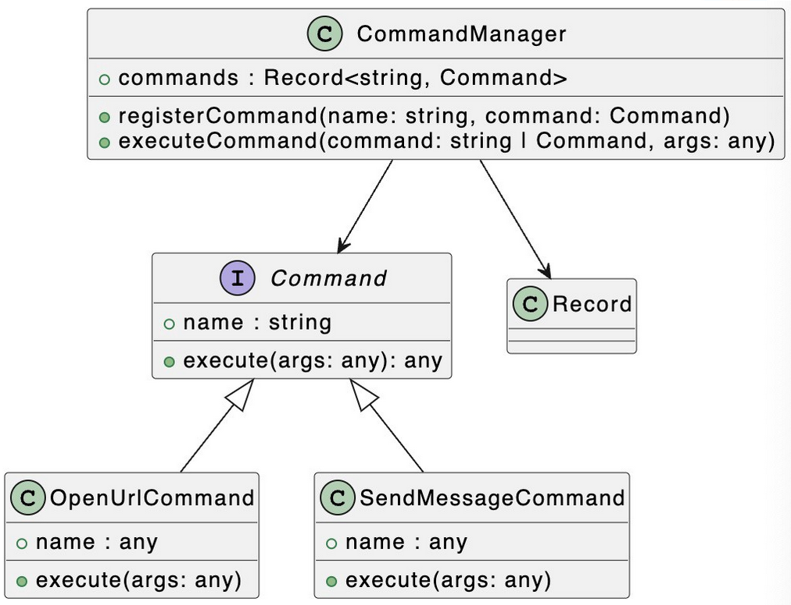

# Command Design Pattern in Typescript using React

[Design Patterns: Command Pattern in TypeScript](https://levelup.gitconnected.com/design-patterns-command-pattern-in-typescript-10b3162e3bee)


### To install Typescript with React
```
npx create-react-app myapp  --template typescript
```


Decouple the Caller and Receiver, and Smooth Out the Differences Between Different Receivers. Allows You To Easily Add Different Commands To Add Different Functions.




## When to use Command Pattern?
<p>

When it is necessary to abstract various execution actions, different parameters are used to determine which action to execute.

The system needs to **decouple** the request **caller** and request **receiver** so that the caller and receiver do not interact directly. The caller of the request does not need to know the existence of the receiver, nor does it need to know who the receiver is, and the receiver does not need to care when it is called.
</p>


# Useful links
[Using TypeScript Mapped Types Like a Pro](https://javascript.plainenglish.io/using-typescript-mapped-types-like-a-pro-be10aef5511a)


[Command Pattern In Practice | goto Command.ts](https://github.com/cacjs/cac)
